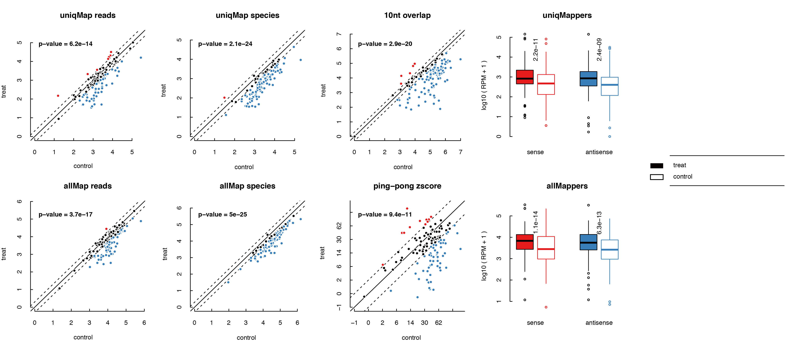

# bed2_summary
get smallRNAseq summary in piclusters, transposons and genes from bed2 files generated by piPipes or other softwares
***
## installation
For easy install, run install.sh in *bed2_summary* folder after download and unzip the source code. It will add all the scripts needed into your PATH and PYTHONPATH. After installation, please use `source ~/.bashrc` or re-load the server.
After this, simple use `run_bed2_summary` to generate the summary of piPipes or mapping result.
***
## usage
*bed2_summary* need at least 4 input (first 4 parameters is required, others is optional):
1. -c control sample name with directory. Use without -t will only give out plots for control sample. eg: path_to_piPipes_result/sample_name_control
2. -o output directory. All the output files will be in this folder including bucket plots and summary. eg: results/piPipes/bed2_summary/
3. -g genome used. default: dm3
4. -n normalization method.  
    miRNA: normalized to reads per million mapped miRNA reads  
    uniq: normalized to reads per million mapped reads exclude miRNA and rRNA reads
5. -t treatment sample name with directory. If set, *bed2_summary* can make comparison between control and treatment
6. -G whether doing analysis genes. default: not analyze  
    analysis for genes may take about 2 hour if 11 CPU is set and the figure pdf for genes is very large.
7. -p CPU numbers used in *bed2_summary*

tips:  
In *bed2_summary*, the input need to be **piPipes_output_folder/sample_name**.  
For example: To say if you used `piPipes small -i oreR_unox.cutadapt.fq.gz -o /project/common/piPipe.result/`, then the follow command is needed for bed2_summary:  
`run_bed2_summary -c  /project/common/piPipe.result/oreR_unox.cutadapt.fq.gz -o [which output folder you want to put the figures and summaries] -g dm3 -n [miRNA or uniq] [-G if you want to include gene analysis]`
Also, if you want to compare two conditions, like if you have ran piPipes for two conditions:  
`piPipes small -i oreR_unox.cutadapt.fq.gz -o /project/common/piPipe.result/`  
`piPipes small -i rhino_KO_unox.cutadapt.fq.gz -o /project/common/piPipe.result/`  
Then you can run:  
`run_bed2_summary -c  /project/common/piPipe.result/oreR_unox.cutadapt.fq.gz -t  /project/common/piPipe.result/rhino_KO_unox.cutadapt.fq.gz -o [which output folder you want to put the figures and summaries] -g dm3 -n [miRNA or uniq] [-G if you want to include gene analysis]`  
***
## output
*bed2_summary* can give three summary files: `prefix.picluster.summary`, `prefix.transposon.summary` and `prefix.gene.summary` which summarize informations for each picluster, transposon or gene in each row. And there are 10 columns in xxx.summary:
1. normalized sense+unique mapped reads.
2. normalized antisense+unique mapped reads.
3. normalized sense+all mapped reads.
4. normalized antisense+all mapped reads.
5. normalized sense+unique mapped small RNA species.
6. normalized antisense+unique mapped small RNA species.
7. normalized sense+all mapped small RNA species.
8. normalized antisense+all mapped small RNA species.
9. ping-pong zscore
10. normalized 10nt overlapped read pairs

*bed2_summary* can also output bucketplot, scatterplot and boxplot for piclusters, transposons and genes respectively. In the plot files, ping-pong score, length distribution and signal profile for each element is included.

## contact
please send questions or bugs to yutianxiong@gmail.com

